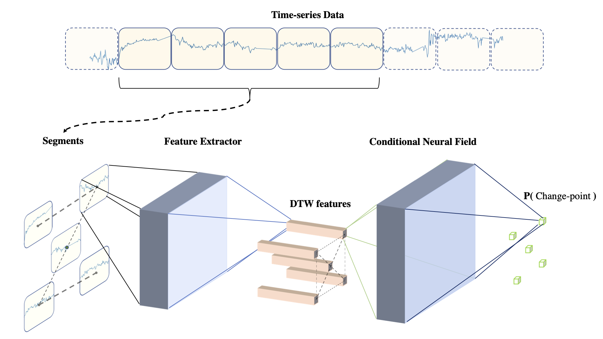

# ShapeCNF: Conditional Neural Field with Shape-Based Features for Change-Point Detection

This repository is the official implementation of our paper "ShapeCNF: Conditional Neural Field with Shape-Based Features for Change-Point Detection".

ShapeCNF is a simple, fast, and accurate change-point detection method which uses shape-based features to model the patterns and a conditional neural field to model the temporal correlations among the time regions. It's the improved version of [Shape-CD: Change-Point Detection in Time-Series Data with Shapes and Neurons](https://arxiv.org/abs/2007.11985).

Our contributions are as follows.
- We propose a hybrid model consisting of shape-based features learning (dynamic time warping, DTW) and conditional neural field (CNF) for change-point detection. ShapeCNF first captures the dissimilarity scores as features between adjacent time intervals. Then, in order to learn temporal dependencies, these features are non-linearly combined by CNF to model the non-linear relationship of the dissimilarities from different time-series dimensions. 

- Extensive experiments on two highly dynamic and complex human activity datasets, i.e. ExtraSensory and HASC, have shown that our method outperforms the state-of-the-art methods for change-point detection, demonstrating its superiority both in terms of speed and accuracy on non-stationary, complex, and highly varying time-series data.

- ShapeCNF is a simple model with only a few hundreds parameters which is order of magnitudes smaller than deep learning models like Long Short-Term Memory (LSTM). Thus, the proposed method is fast enough to be utilized in both online and offline scenarios.

The architecture of ShapeCNF. It has two major components: 1) shape-based feature extractor and 2) conditional neural field. The shape-based feature extractor takes data segments as input, and encodes each segment as a fixed-length vector representation (i.e shape-based feature) by using dynamic time warping. The CRF component takes the set of shape-based features as input and models their temporal correlations. Then CRF component outputs the marginal distribution of each data segment being normal or change point given the set of shape-based features.

## Results

We evaluate our approach on two human acticity time-series datasets, which are often considered for change point detection.

- [ExtraSensory](http://extrasensory.ucsd.edu)
- [HASC](http://hasc.jp/hc2011)

We compare ShapeCNF with three representative baselines: 
- RuLSIF [1].
- KL-CPD [2].
- Long short-term memory (LSTM) [3, 4].

The results are shown below.

**Table 1** AUC of different methods for change-point detection
| Dataset | RuLSIF | LSTM | KL-CPD | ShapeCNF |
| :---: | :---: | :---: | :---: | :---: |
| ExtraSensory | 0.7863 | 0.6158 | 0.6104 | **0.8834** |
| HASC | 0.6332 | 0.4579 | 0.6490 | **0.7627** |

**Table 2** Computational time for per-segment (milisecond)
| Dataset | RuLSIF | LSTM | KL-CPD | ShapeCNF |
| :---: | :---: | :---: | :---: | :---: |
| ExtraSensory | 474.941 | 9.616 | 394.331 | **4.221** |
| HASC | 473.140 | 6.346 | 375.330 | **3.118** |

## Dependencies
TBC

## Training & Evaluating
TBC

## Pre-trained Model
TBC

## Citation
TBC

## Reference
[1] S. Liu, M. Yamada, N. Collier, and M. Sugiyama, “Change-pointdetection in time-series data by relative density-ratio estimation,” Neural Networks, vol. 43, pp. 72–83, 2013.

[2] W.-C. Chang, C.-L. Li, Y. Yang, and B. P ́oczos, “Kernel  change-point  detection  with  auxiliary  deep  generative  models,”arXiv preprint arXiv:1901.06077, 2019.

[3] J. Kim, J. Kim, H. L. T. Thu, and H. Kim, “Long short term memoryrecurrent neural network classifier for intrusion detection,” in 2016 International Conference on Platform Technology and Service (PlatCon). IEEE, 2016, pp. 1–5.

[4] C. Yin, Y. Zhu, J. Fei, and X. He, “A  deep  learning  approach  forintrusion detection using recurrent neural networks,” IEEE Access, vol. 5,pp. 21 954–21 961, 2017

## Contact

- Yuang Shi, yuangshi@u.nus.edu

## Acknowledgement

This work is supervised by Prof. Ooi Wei Tsang in Non-Graduate Non-Exchange (NGNE) Programme, National University of Singapore.
